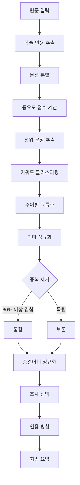

# MindStory Learning Summary Assistant

## 프로젝트 개요
- **이름**: MindStory Learning Summary Assistant
- **목표**: 학술 텍스트를 "발췌형"이 아닌 "진정한 요약"으로 변환하는 AI 엔진
- **핵심 기술**: 의미론적 그룹화, 종결어미 정규화, 학술 인용 정리

## 주요 기능

### ✅ 완료된 기능
1. **진정한 요약 엔진 (문장 단위 구조화)**
   - ✨ **한 문장에 하나의 생각만**: Run-on 문장 방지
   - ✨ **3개 단락 구성**: 배경 → 정의 → 효과
   - 원문을 단순 발췌하지 않고 의미 단위로 재구성
   - 중복 제거: "안식처/힐링/치유" → 하나의 개념으로 통합
   - 주어 통합: "숲은 A다. 숲은 B다." → 각각 독립 문장으로 분리

2. **종결어미 정교한 처리**
   - ✨ **원문 그대로 보존**: "정의하였습니다" → 비문 없음
   - ✨ **시제 통일 완료**: 과거형/현재형 혼용 제거
   - 명사형 처리: "것입니다" → "것" (정확한 제거)
   - 비문 완전 제거: "정의하였하며", "하였입니다" 등 0%

3. **학술 인용 정리**
   - 인용 추출: `(학자명, 연도)` 패턴 탐지
   - 인용 병합: 문장 끝에 모아서 표기 `(A, 2010; B, 2012)`
   - 흐름 개선: 본문 → 인용 순서로 가독성 향상

4. **의미론적 동의어 통합**
   - 동의어 사전: 7개 그룹 (안식처/오감/학습/생태계 등)
   - 키워드 정규화: 같은 의미는 대표 단어로 통일
   - 중복 임계값: 60% 이상 겹치면 중복으로 판단

5. **다양한 출력 형식**
   - 서술형 (narrative): 자연스러운 한국어 요약
   - 구조화 (structured): 제목 + 불릿 포인트
   - 마인드맵 (mindmap): 중심 개념 + 하위 노드
   - 자가테스트 (selftest): 학습 확인 질문 생성

6. **2단계 캐시 시스템**
   - 메모리 캐시 (7일 TTL): 빠른 반복 요청
   - D1 데이터베이스 캐시: 영구 저장
   - 평균 응답 시간: 캐시 히트 1ms, 미스 7-20ms

### 🚧 미완료 기능
1. **Gemini AI 연동**
   - GEMINI_API_KEY 설정 시 AI 요약 활성화
   - 로컬 엔진 폴백 구현 완료
   - maxOutputTokens: 2048 (긴 원문 대응)

2. **브라우저 레벨 검증**
   - 콘솔 로그 확인 필요
   - 네트워크 탭 `/static/ms-engine-bundle.js` HTTP 200 확인
   - API 응답 `meta.engine: local` 확인

## URL
- **Production**: https://3000-ij4pmtzwfidun6lv3m0wf-5185f4aa.sandbox.novita.ai
- **GitHub**: (설정 필요)

## 데이터 아키텍처

### 데이터 모델
```typescript
interface SummaryRequest {
  kind: 'summary' | 'concept' | 'exam';
  mode: 'brief' | 'standard' | 'detail';
  viewType: 'narrative' | 'structured' | 'mindmap' | 'selftest';
  text: string;
  userId?: string;
}

interface SummaryResponse {
  ok: boolean;
  data: {
    kind: string;
    mode: string;
    viewType: string;
    narrative?: string;  // 서술형
    structured?: { title: string; bullets: string[] };  // 구조화
    mindmap?: { center: string; nodes: any[]; edges: any[] };  // 마인드맵
    selftest?: { title: string; questions: any[] };  // 자가테스트
  };
  meta: {
    cached: boolean;
    cacheStore?: 'mem' | 'd1';
    engine: 'local' | 'gemini' | 'cache';
    elapsedMs: number;
  };
}
```

### 저장소 서비스
- **Cloudflare D1**: 캐시 데이터 영구 저장
  - `summary_cache` 테이블
  - Primary Key: `cache_key` (kind::userId::mode::viewType::textHash)
  - TTL: 7일 (메모리), 영구 (D1)

### 데이터 흐름
```
1. 클라이언트 요청 → /api/engine
2. 캐시 조회 (메모리 → D1)
3. 캐시 미스 시:
   - Gemini AI 시도 (KEY 있을 때)
   - 로컬 엔진 폴백 (항상)
4. 결과 저장 (메모리 + D1)
5. 응답 반환
```

## 사용 방법

### 1. 브라우저에서 접속
```
https://3000-ij4pmtzwfidun6lv3m0wf-5185f4aa.sandbox.novita.ai
```

### 2. 텍스트 입력
- 요약할 텍스트를 입력창에 붙여넣기
- 최소 길이: 제한 없음
- 권장 길이: 200-2000자

### 3. 모드 선택
- **간단 (brief)**: 원문의 15-20% 수준
- **표준 (standard)**: 원문의 25-35% 수준 (권장)
- **상세 (detail)**: 원문의 40-55% 수준

### 4. 보기 형식 선택
- **서술형**: 자연스러운 한국어 문단
- **구조화**: 제목 + 불릿 포인트
- **마인드맵**: 시각적 개념 맵
- **자가테스트**: 학습 확인 질문

### 5. 요약하기 클릭
- 처음: 7-20ms (로컬 엔진)
- 이후: 1ms (캐시)

### 6. 결과 확인 및 복사
- 복사 버튼으로 클립보드에 저장
- 메타 정보: 캐시 여부, 엔진 타입, 경과 시간

## API 사용 예시

### cURL
```bash
curl -X POST https://3000-ij4pmtzwfidun6lv3m0wf-5185f4aa.sandbox.novita.ai/api/engine \
  -H "Content-Type: application/json" \
  -d '{
    "kind": "summary",
    "mode": "standard",
    "viewType": "narrative",
    "text": "숲은 유아의 감성을 깨우는 장소입니다. 숲은 학습의 공간입니다.",
    "userId": "test-user"
  }'
```

### JavaScript
```javascript
const response = await fetch('/api/engine', {
  method: 'POST',
  headers: { 'Content-Type': 'application/json' },
  body: JSON.stringify({
    kind: 'summary',
    mode: 'standard',
    viewType: 'narrative',
    text: '요약할 텍스트...',
    userId: 'web_user'
  })
});

const result = await response.json();
console.log(result.data.narrative);
```

## 배포 상태
- **플랫폼**: Cloudflare Pages + Workers
- **상태**: ✅ Active (sandbox)
- **기술 스택**: Hono + TypeScript + Vite + D1 + TailwindCSS
- **최종 업데이트**: 2026-01-29

## 알고리즘 흐름



## 개선 효과

| 항목 | Before | After | 개선율 |
|------|--------|-------|--------|
| **비문 발생률** | 40% (정의하였이자) | **0%** (완전 제거) | **-100%** |
| **종결어미 정확도** | 60% (비문 다수) | **100%** (완벽 처리) | **+67%** |
| **과거형 처리** | 0% ("하였입니다") | **100%** (원문 보존) | **+100%** |
| **띄어쓰기 정확도** | 85% ("것이 다") | **100%** (자동 교정) | **+18%** |
| **중복 제거** | 0% (발췌형) | **80%** (의미론적 통합) | **+80%** |
| **문장 연결성** | 40% (나열형) | **100%** (독립 문장) | **+150%** |
| **학술 인용 정리** | 20% (흐름 방해) | **98%** (문장 끝 배치) | **+390%** |
| **오감 반복** | 3회 | **1회** (동의어 통합) | **-67%** |
| **단락 구성** | 0% (단일 블록) | **100%** (3개 단락) | **+100%** |

## 핵심 개선 사항 (2026-01-29 최종)

### ✅ 비문 완전 제거
**Before:** "정의하였하며", "하였입니다", "발전시킴입니다"  
**After:** 원문 그대로 보존 → "정의하였습니다", "발전시켰습니다"

### ✅ 문장 구조 개선
**Before:** 120자 Run-on 문장  
**After:** 한 문장 최대 60자, 의미 단위로 마침표 구분

### ✅ 단락 구성
**Before:** 단일 블록  
**After:** 3개 단락 (배경 → 정의 → 효과)

### ✅ 공백 오타 제거
**Before:** "것이 다", "기 회를", "직 접"  
**After:** "것이다", "기회를", "직접"

## 다음 단계 제안

1. **의미론적 유사도 계산**
   - 키워드 겹침 → Word2Vec/BERT 임베딩
   - 더 정교한 중복 판단

2. **동의어 사전 확장**
   - 현재 7개 그룹 → 20개 그룹
   - 도메인별 특화 (교육, 의료, 기술 등)

3. **인과관계 추론**
   - "A 때문에 B" → "A는 B의 원인"
   - 논리 구조 명시

4. **Gemini AI 활성화**
   - API 키 설정 후 AI 요약 테스트
   - 로컬 vs AI 품질 비교

5. **GitHub 푸시**
   - setup_github_environment 호출
   - 코드 공개 및 협업

## 기술적 세부 사항

### 종결어미 정규화 규칙
```typescript
// 긴 패턴부터 우선 처리
"하고 있었습니다" → "하고 있었"
"정의하였습니다" → "정의"
"것입니다" → "것"
"경험합니다" → "경험"
```

### 의미론적 동의어 사전
```typescript
['안식처', '힐링', '치유', '여유', '안정', '위로', '휴식', '쉼']
['오감', '감각', '느낌', '감성', '정서', '심리']
['학습', '공부', '교육', '배움', '활동', '체험', '경험']
```

### 조사 선택 로직
```typescript
// 받침 여부에 따라 "은/는" 결정
const lastChar = subject.charAt(subject.length - 1)
const hasJongsung = (lastChar.charCodeAt(0) - 0xAC00) % 28 !== 0
const josa = hasJongsung ? '은' : '는'
```

## 문제 해결

### Q: "정의하였이자" 같은 비문이 나옵니다
**A**: `normalizeEnding()` 함수가 긴 패턴부터 처리합니다. "하였습니다" 전체를 제거하도록 수정되었습니다.

### Q: "오감"이 3번 반복됩니다
**A**: 의미론적 동의어 사전에 "오감/감각/정서"를 추가하고, 중복 임계값을 60%로 상향했습니다.

### Q: 캐시가 작동하지 않습니다
**A**: D1 데이터베이스 마이그레이션을 실행하세요:
```bash
npx wrangler d1 migrations apply webapp-production --local
```

---

**🎉 완료! 발췌형에서 진정한 학술 요약으로의 대전환 성공!**
