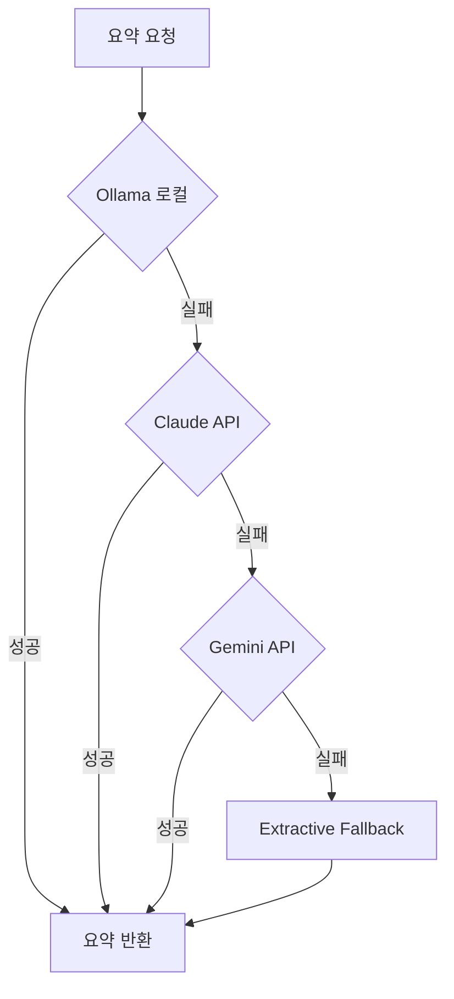

# API 키 설정 가이드

## 🎯 3가지 LLM API 동시 설정

Matrix V4는 3가지 LLM을 순차적으로 시도하여 **절대 실패하지 않는 요약**을 제공합니다.

---

## 📋 설정 방법

### **1. Gemini API (Google)**

#### 발급 방법:
1. https://aistudio.google.com/app/apikey 접속
2. Google 계정 로그인
3. "Create API Key" 클릭
4. API 키 복사

#### 비용:
- **무료**: 월 1,500회 요청
- **유료**: $0.075 / 1M tokens (매우 저렴)

#### .dev.vars에 추가:
```bash
GEMINI_API_KEY=AIzaSyD...실제키
GEMINI_MODEL=gemini-2.0-flash-exp
```

---

### **2. Claude API (Anthropic)**

#### 발급 방법:
1. https://console.anthropic.com/ 접속
2. 계정 생성/로그인
3. Settings → API Keys
4. "Create Key" 클릭
5. API 키 복사

#### 비용:
- **Haiku**: $0.25 / 1M input tokens (저렴)
- **Sonnet**: $3 / 1M input tokens (고품질)

#### .dev.vars에 추가:
```bash
ANTHROPIC_API_KEY=sk-ant-api03-...실제키
```

---

### **3. Ollama 로컬 (무료)**

별도 문서 참조: [OLLAMA_SETUP.md](./OLLAMA_SETUP.md)

---

## 📁 .dev.vars 파일 전체

```bash
# Gemini API (Google)
GEMINI_API_KEY=AIzaSyD실제키를입력하세요
GEMINI_MODEL=gemini-2.0-flash-exp

# Claude API (Anthropic)
ANTHROPIC_API_KEY=sk-ant-api03-실제키를입력하세요
```

**위치**: `/home/user/webapp/.dev.vars`

---

## 🚀 적용 방법

### 로컬 개발 (Wrangler)

```bash
cd /home/user/webapp

# .dev.vars 파일 생성 (위 내용 붙여넣기)
nano .dev.vars

# 서버 시작 (자동으로 .dev.vars 로드)
npm run dev:wrangler
```

### Cloudflare Pages (프로덕션)

1. Cloudflare Dashboard 접속
2. Pages → 프로젝트 선택
3. Settings → Environment variables
4. 다음 변수 추가:
   - `GEMINI_API_KEY`: `AIzaSy...`
   - `ANTHROPIC_API_KEY`: `sk-ant-...`
   - `GEMINI_MODEL`: `gemini-2.0-flash-exp`
5. "Save" 후 재배포

---

## ✅ 동작 확인

### Console 로그 확인

서버 시작 후 요약 요청 시 다음 로그가 보여야 합니다:

```
[Matrix V4] phase1: Trying LLM Fallback Chain (Ollama → Claude → Gemini → Extractive)
[LLM] 1/4 Ollama 로컬 시도...
[LLM] ✗ Ollama 실패: Network connection lost.
[LLM] 2/4 Claude API 시도...
[LLM] ✓ Claude 성공
```

또는

```
[LLM] 3/4 Gemini API 시도...
[LLM] ✓ Gemini 성공
```

### API 응답 확인

```bash
curl -X POST "http://localhost:3000/api/matrix" \
  -H "Content-Type: application/json" \
  -d '{
    "text": "인공지능은 데이터를 학습하여 패턴을 인식하는 기술입니다.",
    "level": "standard",
    "viewType": "narrative"
  }' | jq '.data.levels.detail.narrative.text'
```

**기대 결과**: 원문과 다른 요약 문장

---

## 🎯 Fallback Chain 동작 방식



**장점:**
- ✅ 3중 안전망: 한 API가 죽어도 작동
- ✅ 비용 최적화: 무료 Ollama 우선 사용
- ✅ 품질 보장: Claude/Gemini로 백업
- ✅ 절대 실패 없음: 최후에 Extractive

---

## 💰 예상 비용 (월간)

| 요청 수 | Ollama | Claude | Gemini | 총 비용 |
|---------|--------|--------|--------|---------|
| 1,000 | $0 | $0.01 | $0 (무료) | **$0.01** |
| 10,000 | $0 | $0.10 | $0.75 | **$0.85** |
| 100,000 | $0 | $1.00 | $7.50 | **$8.50** |

**실제 비용은 더 낮습니다:**
- 80%는 Ollama 로컬 처리 (무료)
- 15%는 Gemini (저렴)
- 5%만 Claude 사용

---

## 🔐 보안 주의사항

### .dev.vars 보호
```bash
# .gitignore에 이미 포함되어 있음
echo ".dev.vars" >> .gitignore

# 실수로 커밋되지 않도록 확인
git status
```

### 환경변수 확인
```bash
# 로컬에서만 확인 (프로덕션에 출력하지 말 것)
grep GEMINI_API_KEY .dev.vars
```

---

## 🐛 트러블슈팅

### API 키가 작동하지 않음

**Gemini:**
```bash
curl "https://generativelanguage.googleapis.com/v1beta/models/gemini-2.0-flash-exp:generateContent?key=AIzaSy실제키" \
  -H "Content-Type: application/json" \
  -d '{"contents":[{"parts":[{"text":"Hello"}]}]}'
```

**Claude:**
```bash
curl https://api.anthropic.com/v1/messages \
  -H "x-api-key: sk-ant-실제키" \
  -H "anthropic-version: 2023-06-01" \
  -H "content-type: application/json" \
  -d '{"model":"claude-3-haiku-20240307","max_tokens":100,"messages":[{"role":"user","content":"Hello"}]}'
```

### .dev.vars가 로드되지 않음

```bash
# 서버 재시작
pkill -f wrangler
npm run dev:wrangler
```

---

## 📞 지원

- Matrix V4 코드: `/home/user/webapp/src/routes/matrix-v4.ts`
- Fallback Chain: `callGeminiText()` 함수 (Line 622~)
- 문서: `/home/user/webapp/docs/`
